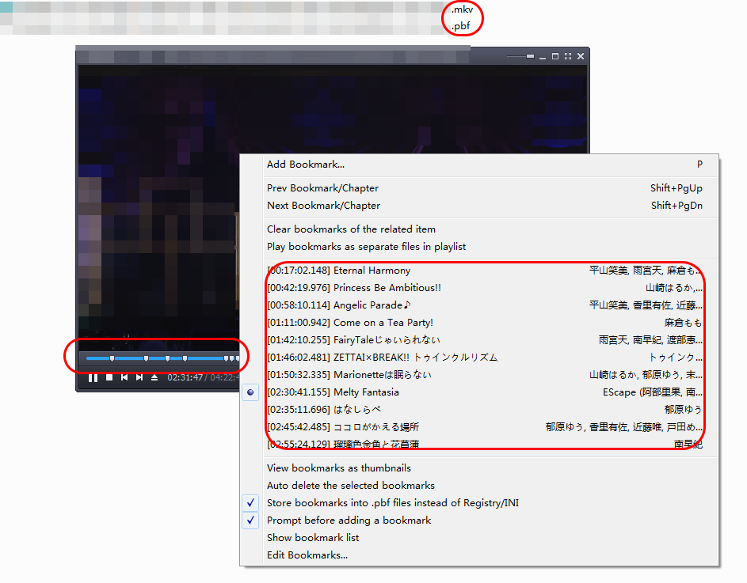

# chapter_converter
Convert between three different video chapter file formats with ease.

## Features

* Auto input format detection: including chapter files and video files with chapters (`.mkv` and `.mp4`. Requires `mkvtoolnix` binaries in path).
* Auto input encoding detection
* Can specify output format and filename
* Clipboard support (input and output) for editing purposes

## Usage

```
usage: chapter_converter.py [-h] [-f {simple,pot,ogm,tab,xml}] [-o OUTPUT]
                            [-c]
                            [filename]

positional arguments:
  filename

optional arguments:
  -h, --help            show this help message and exit
  -f {simple,pot,ogm,tab,xml}, --format {simple,pot,ogm,tab,xml}
                        output format (default: pot)
  -o OUTPUT, --output OUTPUT
                        output filename (default:
                        original_filename.format[.txt])
  -c, --clipboard       automatically process text in clipboard and save it
                        back.
```
### Note

* Output saved as UTF-8-BOM for max compatibility on Windows
* When `-c` is used, you can still pass in a file as input instead.
* When `-c` is used, you can still pass in a output filename (using `-f`) as output instead.

## Supported formats

See also: example files in `examples`.

### MKV and MP4 video containers (inputs only)

Guessed by suffix. Not idiot-proof, please only feed in file with chapters.

### Simple format (`simple`)

I made it up.

Format: 
* Each line: `{timestamp},{title}`

Example: 

```
0:17:02.148,Title1
0:42:19.976,Title2
0:58:10.114,Title3
...
```

### Tab format (`tab`)

Separated by tab

Format: 
* Each line: `{timestamp}	{title}`

Example: 

```
0:17:02.148	Title1
0:42:19.976	Title2
0:58:10.114	Title3
...
```

### OGM format (`ogm`)

Can be recognized by common video tools, such as [MKVToolNix](https://mkvtoolnix.download/). 

Format: 
* Odd lines: `CHAPTER{i:02}={timestamp}`
* Even lines: `CHAPTER{i:02}NAME={tilte}`

`i` starts at 1.

Example:

```
CHAPTER01=0:17:02.148
CHAPTER01NAME=Title1
CHAPTER02=0:42:19.976
CHAPTER02NAME=Title2
CHAPTER03=0:58:10.114
...
```

### XML format (`xml`)

XML chapter format defined by [Matroska specification](https://matroska.org/technical/specs/chapters/index.html).

###  [PotPlayer](https://potplayer.daum.net/) Bookmark format (.pbf) (`pot`)

A format PotPlayer uses for its bookmarks. If you put the file together with the video file (same name except extension, just like any external resources), it will be recognized by PotPlayer just like internal chapters - you can use "H" to view and select, and they will show up as markers on navigation bar too:



It is not ideal, but it's the closest thing to "external chapter file" to my knowledge. 

Format: 

* First line: `[Bookmark]`
* Other lines: `{i}={timestamp_in_ms}*{title}*{some_optional_hash_for_pot_internal_usage}`

`i` starts at 0.

Example:

```
[Bookmark]
0=1022148*Title1*
1=2539976*Titile2*
...
```
